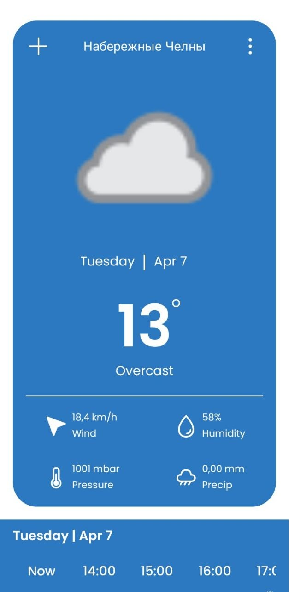
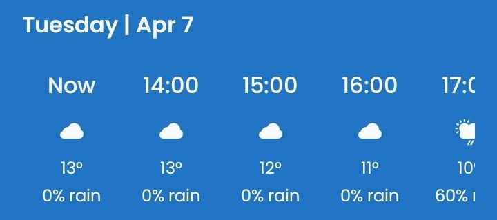
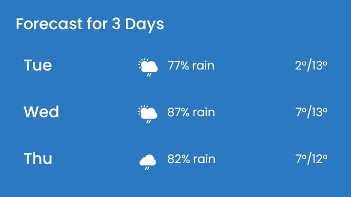

# WeatherApp

Android weather application built with Kotlin using MVVM and Clean Architecture.
The app displays current weather, hourly forecast, and daily forecast using data from WeatherAPI.

**Note**: This project was created as a portfolio application.

---

## Screenshots





---

## Features

* Current weather information
* Hourly forecast (24 hours)
* Daily forecast
* Loading and error handling

---

## Tech Stack

* Kotlin
* MVVM
* Clean Architecture
* Coroutines + Flow
* Hilt (Dependency Injection)
* Retrofit (Network)
* RecyclerView + DiffUtil
* Coil (Image loading)
* ViewBinding

---

## Architecture

The project follows Clean Architecture principles and is divided into three layers:

* **data** – API, DTO, repository implementation
* **domain** – models, use cases, repository interfaces
* **presentation** – UI, ViewModel, state management

Flow of data:

```
UI → ViewModel → UseCase → Repository → API
```

---

## API

* Weather data provided by WeatherAPI

---

## Project Structure

```
common/
data/
di/
domain/
presentation/
```

---

## Getting Started

1. Clone the repository
2. Add your WeatherAPI key
3. Run the project

---

## Future Improvements

- Jetpack Compose migration
- Offline support
- Settings screen
- Location screen

---